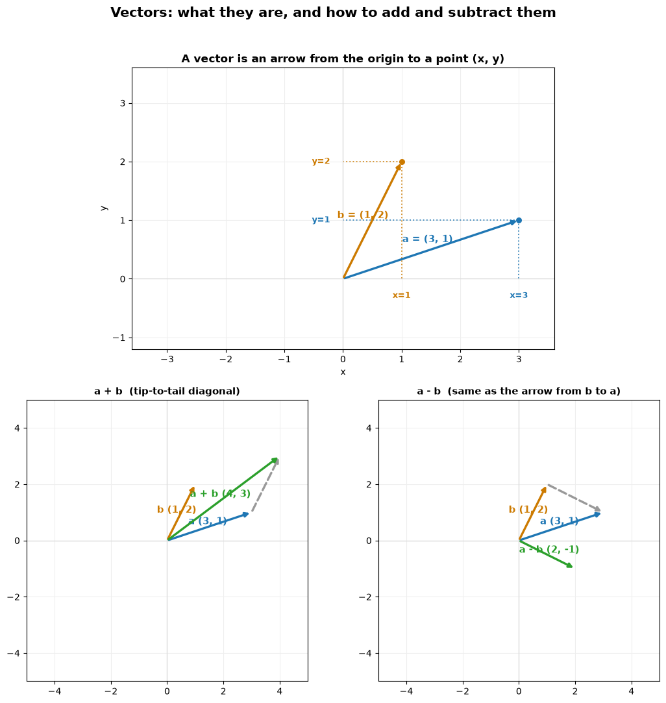

```python
%cd cosine-similarity
```

    [Errno 2] No such file or directory: 'cosine-similarity'
    /home/jovyan/cosine-similarity


```python
%matplotlib inline
```


```python
import os
import numpy as np
import matplotlib.pyplot as plt
from matplotlib.patches import Arc
```


```python
from scripts.vector_add_subtract import build_figure

fig = build_figure()
fig
```


    

    


```python
C_VEC, C_COS, C_DROP = "#1f77b4", "#2ca02c", "#999999"
HIGHLIGHT = 35                       # degrees, the worked example
MARKS = list(range(0, 360, 45))      # 0,45,...,315
```


```python
from scripts.unit_circle_cosine import build_figure
fig = build_figure()
fig   # shows inline
```

<!-- Live interactive version — drag inside the circle to move the angle θ. -->
<iframe src="unit_circle_cosine.html" title="Interactive unit circle — cosine"
        width="100%" height="820" style="border:1px solid #e3e6ea;border-radius:10px;"
        loading="lazy"></iframe>

> 🟢 **Live:** the blue vector has length 1; its green shadow on the x-axis *is*
> `cos θ`. [Open the interactive widget](unit_circle_cosine.html) if the embed
> doesn't render. (Static fallback: `output_5_0.png`.)


```python
from scripts.local_vectors import e, nearest, analogy
```


```python
e("king").shape
```


    (300,)


```python
nearest(e("king") - e("man") + e("woman"))   # king 0.845, queen 0.730, monarch 0.645, ...
```


    [('king', 0.8449392318725586),
     ('queen', 0.7300516366958618),
     ('monarch', 0.6454660296440125),
     ('princess', 0.6156250238418579),
     ('crown_prince', 0.5818675756454468)]


```python
analogy("man", "king", "woman")  # queen 0.730, monarch 0.645, ...  (inputs dropped)
```


    [('queen', 0.7300516366958618),
     ('monarch', 0.6454660296440125),
     ('princess', 0.6156250238418579),
     ('crown_prince', 0.5818675756454468),
     ('prince', 0.5777117013931274)]


```python
analogy("paris", "france", "rome")
```


    [('italy', 0.49453333020210266),
     ('european', 0.48922285437583923),
     ('italian', 0.4792880415916443),
     ('england', 0.46882709860801697),
     ('italians', 0.46355170011520386)]


```python
analogy("italy", "rome", "france")
```


    [('paris', 0.4348357319831848),
     ('albert', 0.4189722537994385),
     ('toronto', 0.3993378281593323),
     ('french', 0.39702263474464417),
     ('donnie', 0.38899776339530945)]


```python
analogy("walk", "walking", "swim")
```


    [('swimming', 0.8626712560653687),
     ('swam', 0.7208389043807983),
     ('swims', 0.704831600189209),
     ('swimmers', 0.6895615458488464),
     ('paddling', 0.6643145084381104)]


```python
analogy("small", "smaller", "big")
```


    [('bigger', 0.8044767379760742),
     ('larger', 0.6294100284576416),
     ('Bigger', 0.5869863629341125),
     ('biggest', 0.5240530967712402),
     ('huge', 0.5195700526237488)]


### Paris and Rome example


```python
nearest(e("lohan")) 
```


    [('lohan', 1.0),
     ('lindsay_lohan', 0.6978281736373901),
     ('britney', 0.6971209049224854),
     ('heidi', 0.6805426478385925),
     ('charlie_sheen', 0.6726322174072266)]


```python

```
